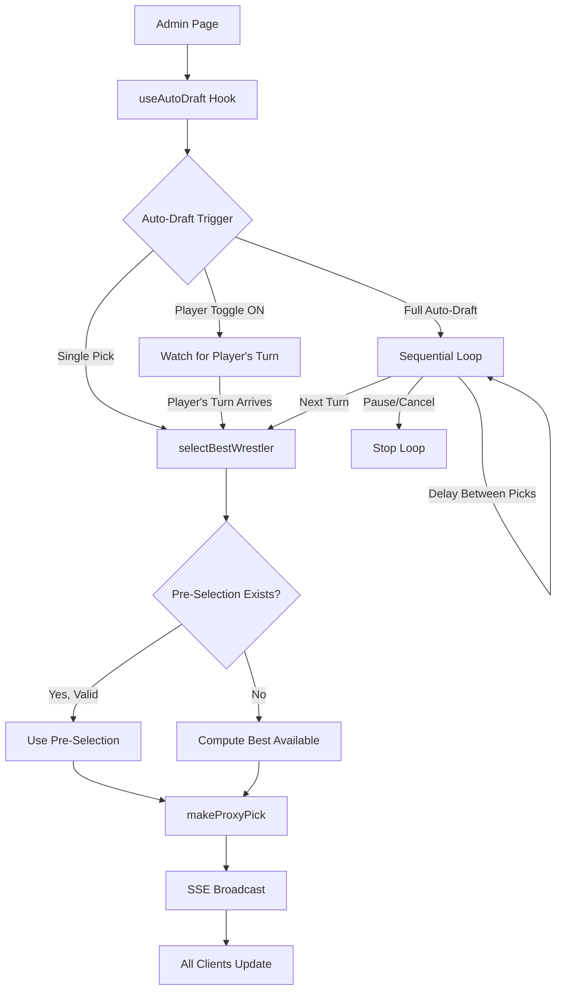

# Design Document: Auto-Draft

## Overview

The Auto-Draft feature adds automated wrestler selection capabilities to the admin draft page. It enables the organizer to auto-pick for the current turn, toggle per-player auto-draft, or run the entire remaining draft automatically — all from client-side controls that reuse the existing `makeProxyPick` server action.

The system is entirely client-side state management layered on top of the existing draft infrastructure. No database schema changes are needed. The admin page orchestrates auto-draft by calling `makeProxyPick` with the best available wrestler, determined by either "By Seed" or "Smart" draft mode. Pre-selections are honored when available.

## Architecture

The auto-draft logic lives in two layers:

1. **Selection logic** (`lib/auto-draft.ts`): A pure function that, given the current draft state and draft mode, computes the best available `sessionWrestlerId` for a given player. This is fully deterministic and testable.
2. **Orchestration logic** (React hook `hooks/use-auto-draft.ts`): Client-side state machine on the admin page that manages per-player auto-draft toggles, full auto-draft run state (running/paused/cancelled), pick delays, and calls `makeProxyPick` at the right time.



### Key Design Decisions

1. **Client-side orchestration**: Auto-draft state (toggles, run status) is ephemeral React state on the admin page. If the admin refreshes, auto-draft stops. This is intentional — the organizer should be in control and a refresh is a natural "stop" mechanism.

2. **Reuse `makeProxyPick`**: Every auto-draft pick goes through the same server action as manual proxy picks. This guarantees SSE events, validation, pick recording, and pre-selection invalidation all work identically. No new server-side code paths for pick recording.

3. **Pure selection function**: The wrestler selection logic is a pure function of `(draftState, playerId, draftMode, rankings)` → `sessionWrestlerId | null`. This makes it trivially testable with property-based tests.

4. **Delay between picks**: Full auto-draft introduces a configurable delay (default ~2 seconds) between picks so the display page can show pick announcements. The delay is implemented with `setTimeout` in the orchestration hook.

## Components and Interfaces

### 1. `selectBestWrestler` — Pure Selection Function

**File**: `lib/auto-draft.ts`

```typescript
import type { DraftState } from "@/app/api/draft/[sessionId]/state/route";

export type DraftMode = "by-seed" | "smart";

export interface AutoDraftRanking {
  draftPriority: number;
  name: string;
  team: string;
  weightClass: number;
  seed: number;
  floRank?: number;
  p4pRank?: number;
}

/**
 * Given the current draft state, a player ID, and a draft mode,
 * returns the sessionWrestlerId of the best available wrestler,
 * or null if no valid pick exists.
 *
 * Pre-selections are checked first. If the player has a valid
 * pre-selection (available + undrafted weight class), it wins.
 */
export function selectBestWrestler(
  state: DraftState,
  playerId: string,
  mode: DraftMode,
  rankings: AutoDraftRanking[],
): string | null;
```

**Selection algorithm**:

1. Compute `lockedWeightClasses` — weight classes the player has already drafted from.
2. Check if the player has a `preSelectedWrestlerId` that is still available and from an unlocked weight class. If so, return it.
3. Filter `state.wrestlers` to those that are `isAvailable` and not in `lockedWeightClasses`.
4. If mode is `"by-seed"`: sort by `seed` ascending, then by `weightClass` ascending as tiebreaker. Return the first.
5. If mode is `"smart"`: match each candidate wrestler against the rankings array by name+weightClass, sort by `draftPriority` ascending, then by `weightClass` ascending as tiebreaker. Wrestlers not found in rankings fall back to seed-based ordering after all ranked wrestlers.
6. Return `null` if no candidates remain.

### 2. `useAutoDraft` — Orchestration Hook

**File**: `hooks/use-auto-draft.ts`

```typescript
export type AutoDraftRunStatus = "idle" | "running" | "paused";

export interface UseAutoDraftReturn {
  /** Which players have auto-draft toggled on */
  autoPlayers: Set<string>;
  /** Toggle auto-draft for a specific player */
  toggleAutoPlayer: (playerId: string) => void;
  /** Trigger a single auto-pick for the current turn */
  autoPickCurrent: () => Promise<void>;
  /** Start full auto-draft for all remaining picks */
  startFullAutoDraft: () => void;
  /** Pause the full auto-draft */
  pauseFullAutoDraft: () => void;
  /** Cancel (stop) the full auto-draft */
  cancelFullAutoDraft: () => void;
  /** Current run status */
  runStatus: AutoDraftRunStatus;
  /** Draft mode selection */
  draftMode: DraftMode;
  /** Set draft mode */
  setDraftMode: (mode: DraftMode) => void;
  /** Delay between picks in ms */
  pickDelay: number;
  /** Set delay between picks */
  setPickDelay: (ms: number) => void;
  /** Error from last auto-pick attempt */
  lastError: string | null;
}

export function useAutoDraft(
  sessionId: string,
  state: DraftState | null,
): UseAutoDraftReturn;
```

**Orchestration behavior**:

- **Single pick** (`autoPickCurrent`): Calls `selectBestWrestler` for the current turn player, then calls `makeProxyPick`. One-shot.
- **Per-player toggle** (`toggleAutoPlayer`): Adds/removes a player ID from `autoPlayers` set. When the draft state updates (via SSE) and the current turn player is in `autoPlayers`, the hook automatically triggers `autoPickCurrent`.
- **Full auto-draft** (`startFullAutoDraft`): Sets `runStatus` to `"running"`. On each state update, if `runStatus === "running"` and the draft is still active, it waits `pickDelay` ms then calls `autoPickCurrent`. Continues until draft completes, is paused, or is cancelled.
- **Pause/Cancel**: Sets `runStatus` to `"paused"` or `"idle"` respectively, which stops the loop on the next iteration.

### 3. Admin Page UI Additions

**File**: `src/app/draft/[sessionId]/admin/admin-draft-client.tsx`

New UI elements added to the existing admin page:

- **Auto Pick button**: Placed next to the current turn display. Calls `autoPickCurrent`.
- **Draft Mode selector**: Dropdown to choose "By Seed" or "Smart" mode. Placed in a new auto-draft controls section.
- **Pick delay slider**: Configurable delay (1–5 seconds) for full auto-draft.
- **Per-player toggle**: A small toggle icon next to each player in `PlayersOverview`. When enabled, the player row gets a visual indicator (e.g., a robot icon or colored badge).
- **Full auto-draft controls**: "Start Auto-Draft" button, which changes to "Pause" / "Cancel" buttons when running. Placed above the proxy pick section.

## Data Models

### Client-Side State (No DB Changes)

All auto-draft state is managed in React:

```typescript
// In useAutoDraft hook
interface AutoDraftState {
  /** Player IDs with auto-draft enabled */
  autoPlayers: Set<string>;
  /** Full auto-draft run status */
  runStatus: "idle" | "running" | "paused";
  /** Selection strategy */
  draftMode: DraftMode; // "by-seed" | "smart"
  /** Delay between auto-picks in ms */
  pickDelay: number; // default: 2000
  /** Last error message */
  lastError: string | null;
}
```

### Rankings Data (Existing)

The `lib/auto-draft-rankings.json` file is already present with this shape:

```typescript
interface AutoDraftRanking {
  draftPriority: number; // 1 = best overall pick
  name: string;
  team: string;
  weightClass: number;
  seed: number;
  floRank?: number;
  p4pRank?: number;
}
```

This is loaded statically at build time (JSON import) and passed to `selectBestWrestler`.

### Existing Data Models Used (Unchanged)

- `DraftState` — full draft state from `/api/draft/[sessionId]/state`
- `DraftStateWrestler` — wrestler with `isAvailable`, `seed`, `weightClass`, `sessionWrestlerId`
- `DraftStatePlayer` — player with `preSelectedWrestlerId`
- `DraftStatePick` — recorded pick with `playerId`, `weightClass`
- `PickResult` — return type from `makeProxyPick`

## Correctness Properties

_A property is a characteristic or behavior that should hold true across all valid executions of a system — essentially, a formal statement about what the system should do. Properties serve as the bridge between human-readable specifications and machine-verifiable correctness guarantees._

### Property 1: Pre-selection takes priority

_For any_ draft state where the current player has a pre-selected wrestler that is still available and from a weight class the player has not yet drafted from, `selectBestWrestler` should return that pre-selected wrestler's `sessionWrestlerId`, regardless of draft mode.

**Validates: Requirements 1.3, 3.5**

### Property 2: By Seed mode selects the lowest seed from undrafted weight classes

_For any_ draft state and player in "by-seed" mode (with no valid pre-selection), `selectBestWrestler` should return a wrestler that: (a) is available, (b) is from a weight class the player has not yet drafted from, and (c) has a seed number less than or equal to every other available wrestler from undrafted weight classes. When multiple wrestlers share the lowest seed, the one from the numerically lowest weight class is selected.

**Validates: Requirements 1.1, 1.2, 4.2, 4.4**

### Property 3: Smart mode selects the lowest draftPriority from undrafted weight classes

_For any_ draft state, player, and rankings list in "smart" mode (with no valid pre-selection), `selectBestWrestler` should return a wrestler that: (a) is available, (b) is from a weight class the player has not yet drafted from, and (c) has a `draftPriority` less than or equal to every other available ranked wrestler from undrafted weight classes. When multiple wrestlers share the lowest priority, the one from the numerically lowest weight class is selected.

**Validates: Requirements 4.3, 4.4**

### Property 4: Selection never returns a wrestler from an already-drafted weight class

_For any_ draft state, player, and draft mode, if `selectBestWrestler` returns a non-null result, the returned wrestler's weight class must not be among the weight classes the player has already drafted from.

**Validates: Requirements 1.2, 4.2, 4.3**

### Property 5: Selection returns null when no valid pick exists

_For any_ draft state where every weight class either has no available wrestlers or the player has already drafted from it, `selectBestWrestler` should return `null`.

**Validates: Requirements 1.5**

## Error Handling

### Selection Errors

| Scenario                                                  | Handling                                                                                                            |
| --------------------------------------------------------- | ------------------------------------------------------------------------------------------------------------------- |
| No available wrestlers from undrafted weight classes      | `selectBestWrestler` returns `null`. The hook displays an error message: "No valid pick available for this player." |
| Wrestler in Smart rankings not found in session wrestlers | Falls back to seed-based ordering for unranked wrestlers. They sort after all ranked wrestlers.                     |
| Pre-selected wrestler no longer available                 | Pre-selection is skipped; falls back to best available selection.                                                   |

### Orchestration Errors

| Scenario                                         | Handling                                                                                                                                                                                                                                                                                   |
| ------------------------------------------------ | ------------------------------------------------------------------------------------------------------------------------------------------------------------------------------------------------------------------------------------------------------------------------------------------ |
| `makeProxyPick` returns `{ success: false }`     | The hook sets `lastError` with the error message. For single picks, stops. For full auto-draft, retries once with re-evaluated selection (handles race condition where wrestler was taken between selection and recording). If retry also fails, pauses auto-draft and surfaces the error. |
| Draft session becomes inactive during auto-draft | The hook checks `state.session.status === "active"` before each pick. If not active, stops auto-draft and sets `runStatus` to `"idle"`.                                                                                                                                                    |
| Admin page unmounts during auto-draft            | The hook's cleanup function (useEffect return) cancels any pending timeouts and stops the auto-draft loop.                                                                                                                                                                                 |
| Network error calling `makeProxyPick`            | Caught by try/catch in the hook. Sets `lastError`, pauses auto-draft for full runs.                                                                                                                                                                                                        |

### Race Condition Mitigation

Since `selectBestWrestler` runs on client-side state and `makeProxyPick` validates server-side, there's a window where another pick could be made between selection and recording. The mitigation:

1. `makeProxyPick` validates wrestler availability server-side and returns an error if unavailable.
2. The hook catches this error and calls `selectBestWrestler` again with the updated state (which will have been updated via SSE by then).
3. If the retry also fails, the auto-draft pauses.

## Testing Strategy

### Property-Based Tests

Use `fast-check` as the property-based testing library. Each property test runs a minimum of 100 iterations.

All property tests target the pure `selectBestWrestler` function in `lib/auto-draft.ts`. Test generators create random but valid `DraftState` objects with:

- Random number of players (2–10)
- Random wrestlers across 10 weight classes with random seeds and availability
- Random existing picks that lock weight classes for players
- Random pre-selections (some valid, some stale)
- Random rankings with `draftPriority` values

Each test is tagged with its design property reference:

```
// Feature: auto-draft, Property 1: Pre-selection takes priority
// Feature: auto-draft, Property 2: By Seed mode selects lowest seed from undrafted weight classes
// Feature: auto-draft, Property 3: Smart mode selects lowest draftPriority from undrafted weight classes
// Feature: auto-draft, Property 4: Selection never returns a wrestler from an already-drafted weight class
// Feature: auto-draft, Property 5: Selection returns null when no valid pick exists
```

Each correctness property is implemented by a single property-based test.

### Unit Tests

Unit tests complement property tests for specific examples and edge cases:

- **Example**: Given a known state with 3 available wrestlers at seeds 2, 5, 1 from different weight classes, "by-seed" mode returns the seed-1 wrestler.
- **Example**: Given a known state with Smart rankings, "smart" mode returns the wrestler with the lowest `draftPriority`.
- **Edge case**: Player has drafted from 9 of 10 weight classes — only the remaining weight class is considered.
- **Edge case**: All 10 weight classes drafted — returns `null`.
- **Edge case**: Pre-selected wrestler is from an already-drafted weight class — pre-selection is skipped, falls back to best available.
- **Edge case**: Pre-selected wrestler is no longer available — pre-selection is skipped.
- **Edge case**: Multiple wrestlers tied on seed, tiebreak by lowest weight class.
- **Edge case**: Wrestler exists in session but not in Smart rankings — sorted after ranked wrestlers.
- **Integration**: `autoPickCurrent` calls `makeProxyPick` with the correct `sessionWrestlerId` (mock `makeProxyPick`).

### Test File Structure

```
__tests__/
  unit/
    auto-draft-selection.test.ts      # Unit tests for selectBestWrestler
  property/
    auto-draft-selection.property.ts  # Property-based tests for selectBestWrestler
```
