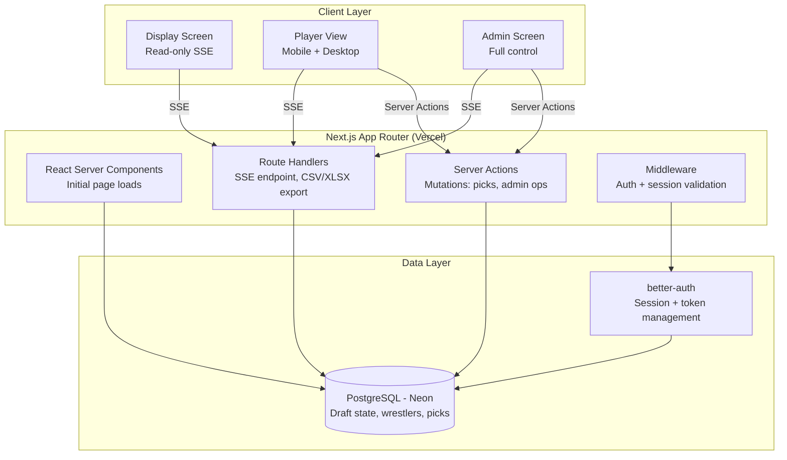
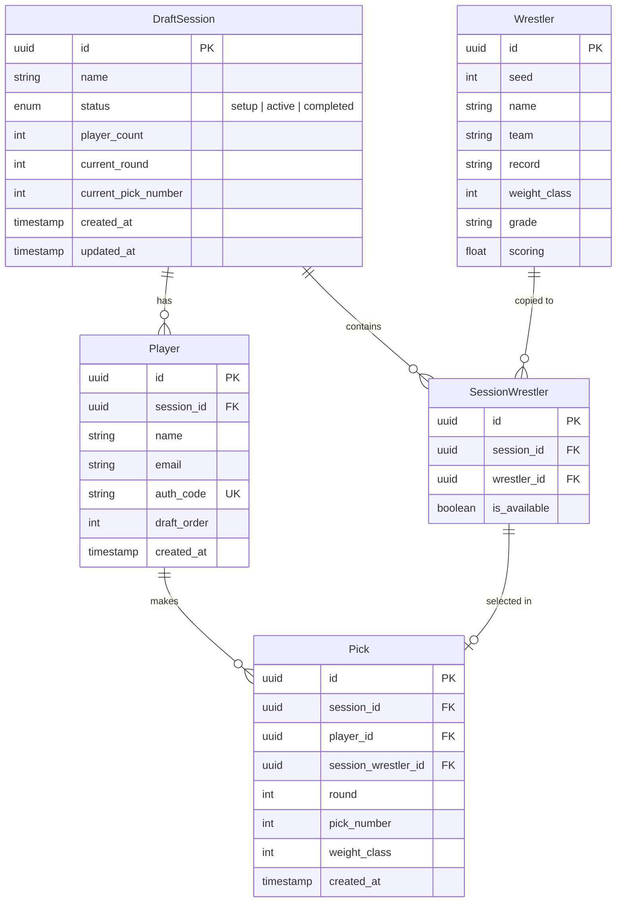

# Design Document: Wrestling Draft

## Overview

The Wrestling Draft application is a real-time, multi-player web app for running snake-format fantasy wrestling drafts based on NCAA tournament data. The system supports multiple concurrent draft sessions, each with 2–16 players drafting from a pool of 330 wrestlers across 10 weight classes.

The application is built on Next.js 14+ (App Router) with Tailwind CSS, backed by PostgreSQL on Neon, and deployed to Vercel. Authentication uses `better-auth` for passwordless login via auth codes and magic links. Real-time updates are delivered via Server-Sent Events (SSE) to keep all clients (player views, display screen, admin screen) synchronized.

### Key Design Decisions

1. **better-auth over next-auth**: better-auth provides a simpler API for custom credential flows (auth codes) and magic links, with built-in session management that integrates cleanly with Next.js App Router server components and route handlers.

2. **SSE over WebSockets**: Server-Sent Events are simpler to deploy on Vercel's serverless infrastructure (no persistent socket connections needed on the server side). SSE is unidirectional (server→client), which fits our use case — clients send picks via HTTP POST and receive updates via SSE. For reconnection, SSE has built-in `Last-Event-ID` support.

3. **Drizzle ORM**: Lightweight, type-safe ORM that works well with Neon's serverless PostgreSQL driver (`@neondatabase/serverless`). Provides schema-as-code and migration tooling.

4. **Server Actions for mutations**: Next.js Server Actions handle all write operations (picks, admin actions, session management), keeping mutation logic server-side with automatic revalidation.

## Architecture



### Request Flow

1. **Page Load**: React Server Components query the database directly and render the initial state.
2. **Real-Time Updates**: Each client opens an SSE connection to `/api/draft/[sessionId]/events`. When a pick is made, the server action writes to the DB and pushes an event to all connected SSE clients for that session.
3. **Mutations**: Player picks, admin actions (proxy pick, undo, reassign), and session management all go through Server Actions, which validate, persist, and broadcast.
4. **Auth**: Middleware checks the better-auth session on every request. Unauthenticated users are redirected to the login page.

## Components and Interfaces

### Route Structure

```
app/
├── page.tsx                          # Landing / session list
├── login/page.tsx                    # Auth code + magic link login
├── draft/[sessionId]/
│   ├── page.tsx                      # Player view (responsive mobile/desktop)
│   ├── display/page.tsx              # Display screen (read-only)
│   └── admin/page.tsx                # Admin screen
├── admin/
│   └── sessions/page.tsx             # Session creation + management
├── api/
│   ├── auth/[...all]/route.ts        # better-auth route handler
│   ├── draft/[sessionId]/
│   │   ├── events/route.ts           # SSE endpoint
│   │   └── export/route.ts           # CSV/XLSX export
│   └── seed/route.ts                 # Seed data import endpoint
```

### Core Server Actions

```typescript
// actions/draft.ts
async function makePick(
  sessionId: string,
  wrestlerId: string,
): Promise<PickResult>;
async function makeProxyPick(
  sessionId: string,
  wrestlerId: string,
): Promise<PickResult>;
async function undoLastPick(sessionId: string): Promise<UndoResult>;
async function reassignPick(
  sessionId: string,
  pickId: string,
  newWrestlerId: string,
): Promise<ReassignResult>;
async function confirmPreSelection(sessionId: string): Promise<PickResult>;

// actions/session.ts
async function createSession(
  name: string,
  playerCount: number,
): Promise<Session>;
async function startSession(sessionId: string): Promise<Session>;
async function setDraftOrder(
  sessionId: string,
  order: PlayerOrder[],
): Promise<void>;

// actions/preselection.ts
async function setPreSelection(
  sessionId: string,
  wrestlerId: string,
): Promise<void>;
async function clearPreSelection(sessionId: string): Promise<void>;

// actions/auth.ts
async function loginWithAuthCode(code: string): Promise<AuthResult>;
async function requestMagicLink(email: string): Promise<void>;
```

### Key Client Components

| Component             | Location       | Purpose                                                   |
| --------------------- | -------------- | --------------------------------------------------------- |
| `WrestlerList`        | Shared         | Filterable wrestler table with availability status        |
| `WeightClassFilter`   | Shared         | Dropdown filter for weight classes, shows locked classes  |
| `PickHistory`         | Shared         | Chronological list of all picks                           |
| `PlayerRoster`        | Player view    | Current player's drafted wrestlers                        |
| `PickConfirmation`    | Player view    | Prominent pick/confirm button when it's the player's turn |
| `PreSelectionControl` | Player view    | UI for setting/changing pre-selection                     |
| `TurnIndicator`       | Shared         | Shows whose turn it is, current round                     |
| `DraftBoard`          | Display screen | Full board showing all picks by player × weight class     |
| `AdminControls`       | Admin screen   | Proxy pick, undo, reassign controls                       |
| `SessionSetup`        | Admin          | Session creation, player management, draft order          |

### SSE Event Types

```typescript
type SSEEvent =
  | {
      type: "pick_made";
      data: {
        pickId: string;
        playerId: string;
        wrestlerId: string;
        weightClass: number;
        round: number;
      };
    }
  | {
      type: "pick_undone";
      data: { pickId: string; wrestlerId: string; playerId: string };
    }
  | {
      type: "pick_reassigned";
      data: { pickId: string; oldWrestlerId: string; newWrestlerId: string };
    }
  | { type: "draft_started"; data: { sessionId: string } }
  | { type: "draft_completed"; data: { sessionId: string } }
  | {
      type: "preselection_invalidated";
      data: { playerId: string; wrestlerId: string };
    }
  | {
      type: "turn_changed";
      data: { playerId: string; round: number; pickNumber: number };
    };
```

## Data Models

### Entity Relationship Diagram



### Schema Details

**DraftSession**: Represents a single draft game. `status` transitions: `setup` → `active` → `completed`. `current_round` and `current_pick_number` track the global draft position.

**Player**: A participant in a session. `auth_code` is a unique 6-character alphanumeric code generated at session setup. `draft_order` is the 1-based position set by the organizer.

**Wrestler**: The master seed data table, populated once from `seeds/Book1.csv`. Contains 330 rows (33 per weight class × 10 weight classes). This table is read-only after import.

**SessionWrestler**: A per-session copy of wrestler availability. When a session is created, 330 rows are inserted (one per wrestler). `is_available` flips to `false` when the wrestler is picked. This allows concurrent sessions to have independent draft states.

**Pick**: Records each draft selection. `round` (1–10) and `pick_number` (global sequential number, 1 through N×10) track position. `weight_class` is denormalized for query convenience.

### Snake Draft Order Calculation

For N players, the pick order within a round:

- Odd rounds (1, 3, 5, ...): positions 1, 2, ..., N
- Even rounds (2, 4, 6, ...): positions N, N-1, ..., 1

The current player is determined by:

```
globalPickIndex = current_pick_number - 1
round = floor(globalPickIndex / N) + 1
positionInRound = globalPickIndex % N
if round is odd: draftOrderPosition = positionInRound + 1
if round is even: draftOrderPosition = N - positionInRound
```

### Drizzle Schema (Key Tables)

```typescript
import {
  pgTable,
  uuid,
  varchar,
  integer,
  boolean,
  timestamp,
  pgEnum,
} from "drizzle-orm/pg-core";

export const sessionStatusEnum = pgEnum("session_status", [
  "setup",
  "active",
  "completed",
]);

export const draftSessions = pgTable("draft_sessions", {
  id: uuid("id").defaultRandom().primaryKey(),
  name: varchar("name", { length: 255 }).notNull(),
  status: sessionStatusEnum("status").default("setup").notNull(),
  playerCount: integer("player_count").notNull(),
  currentRound: integer("current_round").default(1).notNull(),
  currentPickNumber: integer("current_pick_number").default(1).notNull(),
  createdAt: timestamp("created_at").defaultNow().notNull(),
  updatedAt: timestamp("updated_at").defaultNow().notNull(),
});

export const players = pgTable("players", {
  id: uuid("id").defaultRandom().primaryKey(),
  sessionId: uuid("session_id")
    .references(() => draftSessions.id)
    .notNull(),
  name: varchar("name", { length: 255 }).notNull(),
  email: varchar("email", { length: 255 }),
  authCode: varchar("auth_code", { length: 10 }).unique().notNull(),
  draftOrder: integer("draft_order").notNull(),
  createdAt: timestamp("created_at").defaultNow().notNull(),
});

export const wrestlers = pgTable("wrestlers", {
  id: uuid("id").defaultRandom().primaryKey(),
  seed: integer("seed").notNull(),
  name: varchar("name", { length: 255 }).notNull(),
  team: varchar("team", { length: 50 }).notNull(),
  record: varchar("record", { length: 20 }).notNull(),
  weightClass: integer("weight_class").notNull(),
  grade: varchar("grade", { length: 20 }),
  scoring: varchar("scoring", { length: 20 }),
});

export const sessionWrestlers = pgTable("session_wrestlers", {
  id: uuid("id").defaultRandom().primaryKey(),
  sessionId: uuid("session_id")
    .references(() => draftSessions.id)
    .notNull(),
  wrestlerId: uuid("wrestler_id")
    .references(() => wrestlers.id)
    .notNull(),
  isAvailable: boolean("is_available").default(true).notNull(),
});

export const picks = pgTable("picks", {
  id: uuid("id").defaultRandom().primaryKey(),
  sessionId: uuid("session_id")
    .references(() => draftSessions.id)
    .notNull(),
  playerId: uuid("player_id")
    .references(() => players.id)
    .notNull(),
  sessionWrestlerId: uuid("session_wrestler_id")
    .references(() => sessionWrestlers.id)
    .notNull(),
  round: integer("round").notNull(),
  pickNumber: integer("pick_number").notNull(),
  weightClass: integer("weight_class").notNull(),
  createdAt: timestamp("created_at").defaultNow().notNull(),
});
```

## Correctness Properties

_A property is a characteristic or behavior that should hold true across all valid executions of a system — essentially, a formal statement about what the system should do. Properties serve as the bridge between human-readable specifications and machine-verifiable correctness guarantees._

### Property 1: Session creation validates player count

_For any_ integer `n`, creating a draft session with `n` players should succeed if and only if `2 <= n <= 16`. Values outside this range should be rejected.

**Validates: Requirements 1.1**

### Property 2: Session creation populates wrestlers

_For any_ newly created draft session, the session should contain exactly 330 session wrestlers, with exactly 33 per weight class across all 10 weight classes.

**Validates: Requirements 1.2**

### Property 3: Session lifecycle state machine

_For any_ draft session, the status transitions must follow: `setup` → `active` → `completed`. A newly created session must have status `setup`. Starting a session must transition it to `active`. Completing all picks must transition it to `completed`. No other transitions are valid.

**Validates: Requirements 1.4, 1.5, 1.6**

### Property 4: Auth code uniqueness

_For any_ draft session with N players, all N generated auth codes must be distinct from each other and from auth codes in any other session.

**Validates: Requirements 2.2**

### Property 5: Auth code round trip

_For any_ player with a generated auth code, submitting that auth code should authenticate the player and return the correct session ID and player ID.

**Validates: Requirements 2.3**

### Property 6: Invalid auth code rejection

_For any_ string that does not match any auth code in the system, submitting it as an auth code should result in an authentication failure.

**Validates: Requirements 2.4**

### Property 7: Snake draft order correctness

_For any_ number of players N (2 ≤ N ≤ 16) and any round R (1 ≤ R ≤ 10), the draft order function should produce positions 1..N in ascending order for odd rounds and N..1 in descending order for even rounds. Furthermore, after each pick, the turn should advance to the next position in this sequence, wrapping to the next round when a round is complete.

**Validates: Requirements 3.2, 3.3, 3.4**

### Property 8: Draft has exactly 10 rounds

_For any_ completed draft session with N players, the total number of picks should be exactly N × 10, spanning exactly 10 rounds.

**Validates: Requirements 3.5**

### Property 9: Picked wrestler becomes unavailable

_For any_ valid pick of a wrestler, that wrestler should be marked as unavailable immediately after the pick. Any subsequent attempt to pick the same wrestler by any player in the same session should be rejected.

**Validates: Requirements 4.1, 4.4, 5.3**

### Property 10: Weight class uniqueness per player

_For any_ player who has already picked a wrestler from weight class W, any subsequent attempt to pick another wrestler from weight class W should be rejected.

**Validates: Requirements 4.2, 4.5, 5.5**

### Property 11: Complete roster invariant

_For any_ completed draft session, each player should have exactly 10 picks, one from each of the 10 weight classes (125, 133, 141, 149, 157, 165, 174, 184, 197, 285).

**Validates: Requirements 4.6**

### Property 12: Wrestler display contains required fields

_For any_ wrestler record, the display representation should include the seed number, name, team abbreviation, record, and weight class.

**Validates: Requirements 5.1**

### Property 13: Weight class filter and sort

_For any_ weight class W, filtering the wrestler list by W should return only wrestlers belonging to W, and those wrestlers should be sorted by seed number in ascending order.

**Validates: Requirements 5.2, 5.4**

### Property 14: Pre-selection management

_For any_ player whose turn it is not, the player should be able to set a pre-selection. Changing the pre-selection should replace the previous one. Removing the pre-selection should clear it. At most one pre-selection should exist per player at any time.

**Validates: Requirements 6.1, 6.4**

### Property 15: Pre-selection invalidation

_For any_ player with a pre-selection, if the pre-selected wrestler is picked by another player, the pre-selection should be automatically cleared.

**Validates: Requirements 6.3**

### Property 16: Pre-selection confirmation becomes pick

_For any_ player whose turn it is and who has a valid pre-selection, confirming the pre-selection should record it as an official pick with the same validation rules as a regular pick.

**Validates: Requirements 6.5**

### Property 17: Pick history contains required fields

_For any_ pick in the history, the display representation should include the player name, wrestler name, and weight class.

**Validates: Requirements 7.2**

### Property 18: Client state update on pick event

_For any_ client state and any incoming pick event, applying the event should update the wrestler availability (mark wrestler unavailable), append to pick history, and update the current turn indicator — all without data loss or inconsistency.

**Validates: Requirements 10.2**

### Property 19: State restoration on reconnect

_For any_ draft session state, fetching the full state from the server should return a state that is equivalent to the state that would result from replaying all pick events from the beginning.

**Validates: Requirements 10.4**

### Property 20: CSV parsing extracts required fields

_For any_ well-formed CSV row with the expected columns, parsing should extract the seed number, name, team abbreviation, record, and weight class, and all extracted values should be non-empty.

**Validates: Requirements 11.2**

### Property 21: Proxy pick equivalence

_For any_ proxy pick made by the organizer on behalf of a player, the resulting state change (pick recorded, wrestler unavailable, turn advanced) should be identical to the state change that would result from the player making the pick directly.

**Validates: Requirements 12.2, 12.3**

### Property 22: Undo pick round trip

_For any_ draft state with at least one pick, undoing the most recent pick should restore the wrestler to available, remove the pick from the player's roster, and revert the current turn to the player whose pick was undone — effectively returning to the state before the pick was made.

**Validates: Requirements 12.4, 12.5**

### Property 23: Reassign pick correctness

_For any_ reassignment of the most recent pick to a different wrestler within the same weight class, the previously picked wrestler should become available, the new wrestler should become unavailable, and the pick record should reference the new wrestler. The weight class of the pick should remain unchanged.

**Validates: Requirements 12.6, 12.7**

### Property 24: Export data completeness

_For any_ completed draft session, the exported data should contain one entry per player per weight class, and each entry should include the player name, wrestler seed, wrestler name, team abbreviation, record, and weight class.

**Validates: Requirements 13.2**

### Property 25: CSV export round trip

_For any_ completed draft session, exporting to CSV and then parsing the CSV should recover all pick data with matching player names, wrestler names, seeds, teams, records, and weight classes.

**Validates: Requirements 13.3**

### Property 26: XLSX export round trip

_For any_ completed draft session, exporting to XLSX and then parsing the XLSX should recover all pick data with matching player names, wrestler names, seeds, teams, records, and weight classes.

**Validates: Requirements 13.4**

## Error Handling

### Authentication Errors

| Error                          | Handling                                                                                        |
| ------------------------------ | ----------------------------------------------------------------------------------------------- |
| Invalid auth code              | Return 401 with message "Invalid auth code. Please check your code and try again."              |
| Expired/used magic link        | Return 401 with message "This link has expired or already been used. Please request a new one." |
| Unauthenticated access         | Middleware redirects to `/login`                                                                |
| Player accessing wrong session | Return 403 with message "You are not a participant in this draft session."                      |

### Draft Operation Errors

| Error                                   | Handling                                                                              |
| --------------------------------------- | ------------------------------------------------------------------------------------- |
| Pick out of turn                        | Return 400 with message "It is not your turn to pick."                                |
| Wrestler already picked                 | Return 409 with message "This wrestler has already been drafted."                     |
| Duplicate weight class                  | Return 409 with message "You have already drafted a wrestler from this weight class." |
| Pick in non-active session              | Return 400 with message "This draft session is not currently active."                 |
| Undo with no picks                      | Return 400 with message "There are no picks to undo."                                 |
| Reassign to same weight class violation | Return 400 with message "Replacement wrestler must be from the same weight class."    |
| Reassign to unavailable wrestler        | Return 409 with message "The replacement wrestler has already been drafted."          |

### Data Import Errors

| Error                         | Handling                                                                                             |
| ----------------------------- | ---------------------------------------------------------------------------------------------------- |
| CSV file not found            | Log error, return 500 with message "Seed data file not found."                                       |
| Malformed CSV row             | Skip row, log warning with row number and content. Continue processing remaining rows.               |
| Unexpected weight class value | Skip row, log warning. Only accept weight classes: 125, 133, 141, 149, 157, 165, 174, 184, 197, 285. |
| Duplicate wrestler entry      | Skip duplicate, log warning. Deduplicate by (seed, weight_class) pair.                               |

### Real-Time Connection Errors

| Error                    | Handling                                                                                                             |
| ------------------------ | -------------------------------------------------------------------------------------------------------------------- |
| SSE connection lost      | Client auto-reconnects using EventSource built-in retry. On reconnect, fetch full state via REST endpoint to resync. |
| SSE endpoint unavailable | Return 503. Client retries with exponential backoff (1s, 2s, 4s, max 30s).                                           |
| Stale client state       | On reconnect, client fetches full draft state and replaces local state entirely.                                     |

### Export Errors

| Error                           | Handling                                                                         |
| ------------------------------- | -------------------------------------------------------------------------------- |
| Export on non-completed session | Return 400 with message "Export is only available for completed draft sessions." |
| XLSX generation failure         | Fall back to CSV export, log error. Notify organizer that XLSX failed.           |

## Testing Strategy

### Dual Testing Approach

This project uses both unit tests and property-based tests for comprehensive coverage:

- **Unit tests** verify specific examples, edge cases, integration points, and error conditions
- **Property-based tests** verify universal properties across randomly generated inputs
- Together they provide both concrete bug detection and general correctness guarantees

### Property-Based Testing Configuration

- **Library**: [fast-check](https://github.com/dubzzz/fast-check) for TypeScript/JavaScript
- **Minimum iterations**: 100 per property test
- **Each property test must reference its design document property** using the tag format:
  `Feature: wrestling-draft, Property {number}: {property_text}`
- **Each correctness property must be implemented by a single property-based test**

### Test Organization

```
__tests__/
├── unit/
│   ├── draft-order.test.ts        # Snake draft order calculation
│   ├── pick-validation.test.ts    # Pick constraint checks
│   ├── csv-parser.test.ts         # CSV import parsing
│   ├── export.test.ts             # CSV/XLSX export generation
│   ├── session-lifecycle.test.ts  # Session state transitions
│   └── auth.test.ts               # Auth code generation/validation
├── property/
│   ├── draft-order.property.ts    # Properties 7, 8
│   ├── pick-rules.property.ts     # Properties 9, 10, 11
│   ├── session.property.ts        # Properties 1, 2, 3, 4
│   ├── auth.property.ts           # Properties 5, 6
│   ├── wrestler-display.property.ts # Properties 12, 13
│   ├── preselection.property.ts   # Properties 14, 15, 16
│   ├── admin-actions.property.ts  # Properties 21, 22, 23
│   ├── export.property.ts         # Properties 24, 25, 26
│   ├── csv-parser.property.ts     # Property 20
│   ├── realtime.property.ts       # Properties 17, 18, 19
│   └── generators/
│       ├── wrestler.gen.ts        # Random wrestler generators
│       ├── session.gen.ts         # Random session state generators
│       ├── pick.gen.ts            # Random pick sequence generators
│       └── player.gen.ts          # Random player generators
└── integration/
    ├── draft-flow.test.ts         # Full draft flow end-to-end
    ├── sse-sync.test.ts           # Real-time synchronization
    └── seed-import.test.ts        # CSV seed data import
```

### Unit Test Focus Areas

- Specific edge cases: 2-player draft, 16-player draft, round boundaries in snake order
- Error conditions: all error scenarios from the Error Handling section
- CSV parsing: malformed rows, missing fields, unexpected weight classes
- Auth code generation: format validation, collision avoidance
- Export: correct CSV/XLSX formatting, field completeness

### Property Test Focus Areas

- Snake draft order: correctness across all valid player counts and rounds
- Pick validation: wrestler availability and weight class constraints
- Session lifecycle: valid state transitions only
- Pre-selection: management, invalidation, confirmation
- Admin actions: proxy pick equivalence, undo round-trip, reassign correctness
- Export: data completeness and round-trip parsing
- Client state: consistency after applying events

### Custom Generators (fast-check)

Key generators needed:

- `arbitraryWeightClass()`: generates one of the 10 valid weight classes
- `arbitraryWrestler(weightClass?)`: generates a wrestler with valid seed, name, team, record
- `arbitraryPlayer(sessionId?)`: generates a player with valid auth code and draft order
- `arbitraryDraftState(playerCount, picksCompleted)`: generates a consistent draft state with N players and M picks already made, respecting all constraints
- `arbitraryPickSequence(playerCount, rounds)`: generates a valid sequence of picks following snake order and weight class constraints
